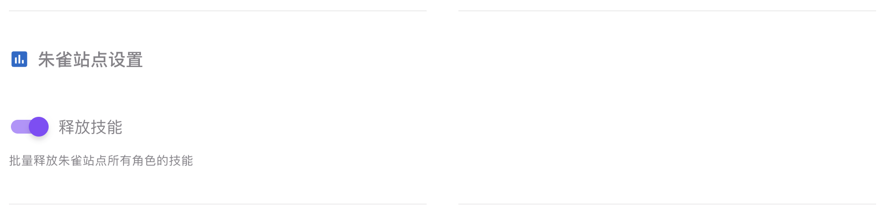

# PTAutoTask开发说明
## 前言
首先感谢你看到这里，无论最后你是否提交了代码，都感谢你为开源项目做出的贡献。  
由于本项目采用模块化设计，应该可以兼容不少nexus架构的站点，以下是一个简单的开发教程，希望对你有所帮助。  
请确认代码无误后提交Pull Request

## 开发流程
1. 参考MP插件开发流程配置好环境
2. 将本项目ptautotask文件夹复制到MP的plugins目录下
3. 以下以新增朱雀站点为例进行代码编写
### ZhuQue
**首先请观察站点的域名，剔除如PT、BT等关键词，留下一个简单的名字并确保首字母大写，作为站点文件的名称**。因此我们将名字定为ZhuQue。
#### 1. 编写站点文件
在`sites/`目录下新建一个文件`ZhuQue.py`，并编写以下代码
```python
from ..base.NexusPHP import NexusPHP
from ..base.BaseTask import BaseTask


class ZhuQue(NexusPHP):# 需要跟我们刚才确定的类名同步

    def __init__(self, cookie):
        super().__init__(cookie)

    @staticmethod
    def get_site_name():
        return "朱雀" # 这边是站点的名称

    @staticmethod
    def get_url():
        return "https://zhuque.in" # 这边是站点的首页地址，记得右侧不要有斜杠

    @staticmethod
    def get_site_domain():
        return "zhuque.in"  # 这边是站点的域名，即去除协议，www以及斜杠后的内容（与MP中定义同步）


class Tasks(BaseTask): # 统一命名为Tasks，插件会扫描该类下的方法
    def __init__(self, cookie: str):
        super().__init__(ZhuQue(cookie)) # 仅需修改init里的类名，本处为ZhuQue

```
上面我们就完成了一个最小的站点文件编写，即只需要继承NexusPHP类并实现三个静态方法即可（站点名称、url、domain）。
#### 2. 编写站点任务
在上面我们已经编写了站点文件，接下来我们需要为站点添加任务。
你想的没错，如果要添加任务只需要在对应站点文件的Tasks类中添加方法即可。
假设我们要添加一个任务——批量释放技能，我们将其定义为`daily_release_skill`(为了能顺利请求站点页面，我们将请求逻辑放在站点类里，将任务逻辑放在Tasks类里)，因此添加的代码如下
```python
# 以下是新增的两个依赖，一个是请求网页的，一个是修饰任务的
from ..utils.custom_requests import CustomRequests
from ..base.Decorator import task_info

class ZhuQue(NexusPHP):
    # 以下添加到ZhuQue类中
    def do_release_skill(self):
        """
        批量释放技能
        """
        response = CustomRequests.post(self.url+"/api/gaming/fireGenshinCharacterMagic", headers=self.headers, data={'all': 1, 'resetModal': True})
        rsp_json = response.json()
        return f'技能释放成功，获得:{rsp_json.get('data').get('bonus')}灵石' if rsp_json.get('status') == 200 else "技能释放失败"

class Tasks(BaseTask):
    # 以下添加到Tasks类中
    @task_info("释放技能", "批量释放朱雀站点所有角色的技能") # 任务装饰器，第一个参数是任务名称，第二个参数是任务描述（必须填写！否则不会识别成任务）
    def daily_release_skill(self):
        # 使用client属性调用站点类中的方法
        return self.client.do_release_skill()

```

最终合并文件如下：
```python
from ..base.Decorator import task_info
from ..base.NexusPHP import NexusPHP
from ..base.BaseTask import BaseTask
from ..utils.custom_requests import CustomRequests

class ZhuQue(NexusPHP):

    def __init__(self, cookie):
        super().__init__(cookie)

    @staticmethod
    def get_site_name():
        return "朱雀"

    @staticmethod
    def get_url():
        return "https://zhuque.in"

    @staticmethod
    def get_site_domain():
        return "zhuque.in"

    def do_release_skill(self):
        """
        批量释放技能
        """
        response = CustomRequests.post(self.url+"/api/gaming/fireGenshinCharacterMagic", headers=self.headers, data={'all': 1, 'resetModal': True})
        rsp_json = response.json()
        return f'技能释放成功，获得:{rsp_json.get('data').get('bonus')}灵石' if rsp_json.get('status') == 200 else "技能释放失败"


class Tasks(BaseTask):
    def __init__(self, cookie: str):
        super().__init__(ZhuQue(cookie))

    @task_info("释放技能", "批量释放朱雀站点所有角色的技能")
    def daily_release_skill(self):
        return self.client.do_release_skill()


```
上面这样我们就实现了朱雀站点的技能释放任务，当然你也可以添加签到、签到等任务，只需要在Tasks类中添加方法即可（切记用`@task_info`修饰）。

#### 3. 测试
在完成以上两步后，我们可以进行测试了，此处略。无误后即可提交pull request。


## 结语
通过以上内容，即可完成一个简单的站点添加开发。